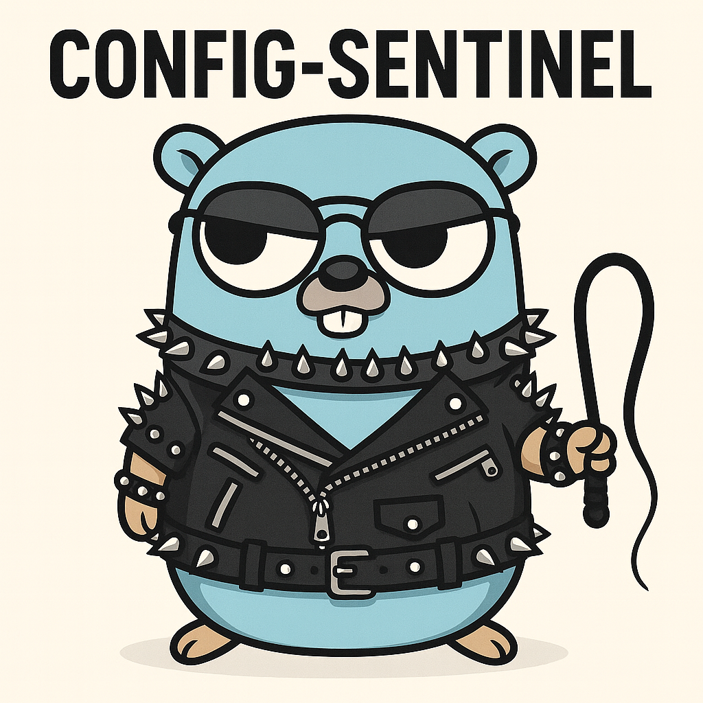

# config-sentinel

**config-sentinel** is a lightweight microservice for enforcing configuration policies. It parses structured data (YAML and JSON), evaluates it against declarative rules using JSONPath-based matching, and enforces control logic such as explicitly including or excluding parts of the input.

> ATTENTION: this is a proof of concept. It basically does what I need it to do. Don't expect a lot of new features or active maintenance.

---

## ✨ Features

- ✅ YAML & JSON configuration input
- 🔍 JSONPath-based rule matching
- 🔐 JWT claim inspection with path-based selectors
- ⚖️ Rule types: `included-for-claim`, `excluded-for-claim`
- 🧩 Flexible rule definitions via YAML
- 🔁 Stateless microservice interface
- 🚀 Simple HTTP API for integration

> **ATTENTION:** **NO**, JWT verification, you need to use a proxy to make sure the `Authorization` header is valid. Not doing so is security by obscurity at best.

---

## ▶️ Usage

```
go run ./
Usage: config-sentinel <command>

A microservice to apply rule based modifications to json/yaml files.

Flags:
  -h, --help    Show context-sensitive help.

Commands:
  serve [flags]
    Start server.

Run "config-sentinel <command> --help" for more information on a command.

config-sentinel: error: expected "serve"
exit status 80
```

```
go run ./ serve --help
Usage: config-sentinel serve [flags]

Start server.

Flags:
  -h, --help                        Show context-sensitive help.

      --bind-addr="0.0.0.0:1984"    Port to listen on ($BIND_ADDR)
      --input="./input.yaml"        Input file to read base configuration from ($INPUT_FILE)
      --rules="./rules.yaml"        Rules file ($RULES_FILE)
```

---

## 📦 Rules config

The general idea is that for a rule to match, the JSONPath you specify as `rule.path` (or as value for claim based rules) needs to return a non-empty result.

For the upcoming example we asssume we have a config structure like this for the [OpenCloud External Sites](https://github.com/opencloud-eu/web-extensions/tree/main/packages/web-app-external-sites) app.

```yaml
web-app-external-sites:
  config:
    dashboards:
      - name: 'My Dashboard'
        path: '/'
        color: 'green'
        icon: 'grid'
        sites:
          - name: 'Plex'
            url: 'https://plex.local'
            target: 'external'
            color: '#e5a00d'
            icon: 'play'
            priority: 50
            description: 'Multimedia streaming service'

          - name: 'Office'
            sites:
              - name: 'Paperless NGX'
                url: 'https://paperless.local'
                target: 'external'
                color: '#17541f'
                icon: 'leaf'
                description: 'Document management system.'

          - name: 'Administration'
            sites:
              - name: 'OpenMediaVault'
                url: 'http://omv.local/'
                color: '#17541f'
                icon: 'server'
                description: 'Server administration panel.'
```

### Show `Administration` group only for admins based on JWT claims

```yaml
rules:
  ## when { groups: ["admin"] } in JWT claims
  - path: '$["web-app-external-sites"].config.dashboards[0].sites[?(@.name == "Administration")]'
    rule: included-for-claim
    value: $.groups[?(@ == "admin")]
  ## or when { groups: { admin: { ... } } }
  # value: $.groups.admin
```

### Hide `Administration` group for guests based on JWT claims

This is pretty much the inverted logic to the `included-for-claim` rule above.

```yaml
rules:
  ## when { groups: ["guest"] } in JWT claims
  - path: '$["web-app-external-sites"].config.dashboards[0].sites[?(@.name == "Administration")]'
    rule: excluded-for-claim
    value: $.groups[?(@ == "guest")]
  ## or when { groups: { guest: { ... } } }
  # value: $.groups.guest
```
